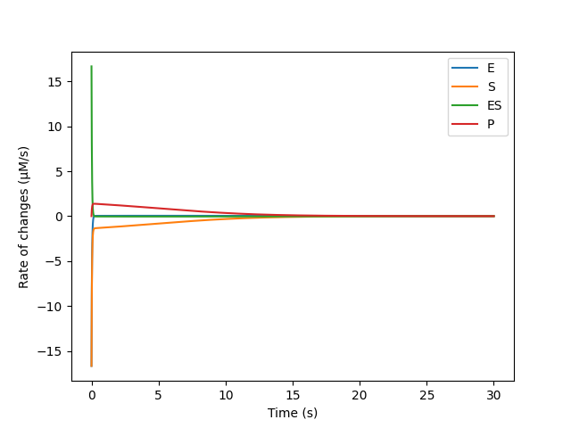
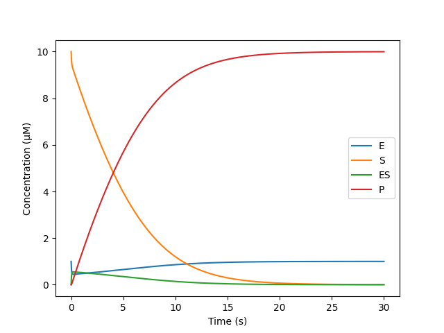
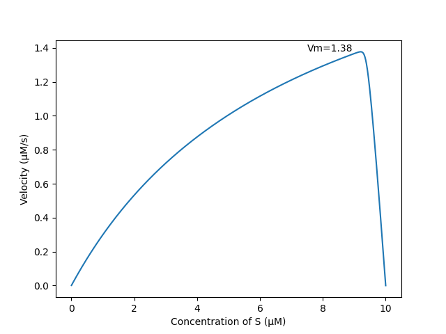

# Answers to Q2

**Q2.1** Let $[A]$ denote the concentration of material $A$. According to the law of mass action, the rate of changes are:

$\frac{\mathrm{d}}{\mathrm{d}t}[E] = -k_1[E][S] + k_2[ES] + k_3[ES]$

$\frac{\mathrm{d}}{\mathrm{d}t}[S] = -k_1[E][S] + k_2[ES]$

$\frac{\mathrm{d}}{\mathrm{d}t}[ES] = k_1[E][S] - k_2[ES] - k_3[ES]$

$\frac{\mathrm{d}}{\mathrm{d}t}[P] = k_3[ES]$

**Q2.2** 

Rate of changes:

Concentration:

**Q2.3**

According to the below plot, the value of Vm is 1.38μM/s.

